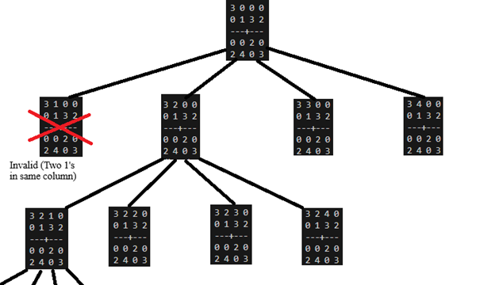
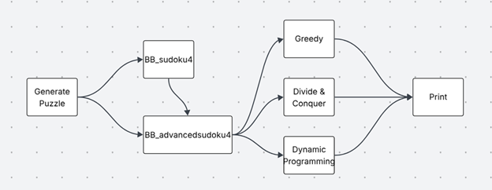
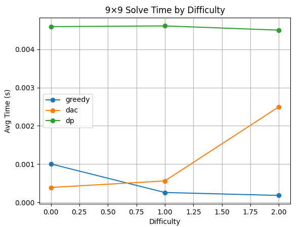
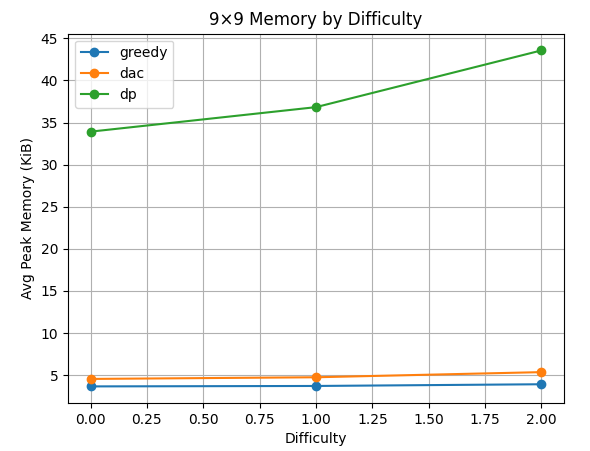
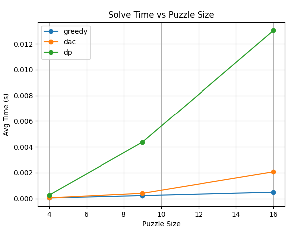
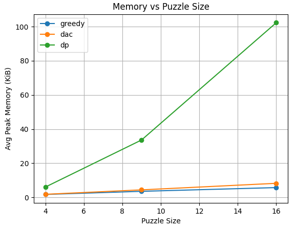
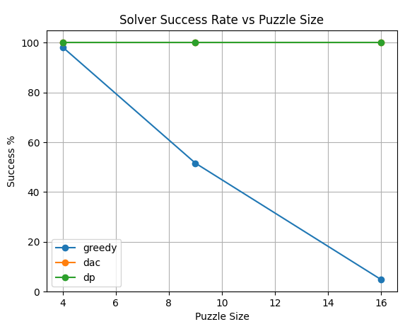

# Analysis of All Strategies

## Goals
[cite_start]The main goal of this assignment was to utilize my understanding of greedy, divide & conquer, and dynamic programming algorithms to solve sudoku puzzles[cite: 3]. [cite_start]For my main project, I created a divide & conquer and dynamic programming solution[cite: 4]. [cite_start]For the extra credit, I also created a greedy algorithm[cite: 5].

***

## Computer Specifications
* [cite_start]**Computer Model**: Custom Build [cite: 7]
* [cite_start]**OS**: Windows 11 [cite: 8]
* [cite_start]**Software Information**: Python 3.11 – VSCode [cite: 9]
* [cite_start]**CPU**: AMD Ryzen 7 7800X3D 8-Cores 16-Logical Processors @ 5.00 GHz [cite: 10]
* [cite_start]**Memory**: 32 GB RAM [cite: 11]

***

## Algorithms

### Greedy
[cite_start]My first algorithm was a greedy algorithm that processes inputs by assuming the local optimal solution is the best for each location within the sudoku table (left to right + top to bottom)[cite: 14]. [cite_start]It iterates through each grid location and assigns the lowest possible valid number[cite: 15]. [cite_start]Because it's a greedy algorithm, it commits to decisions without backtracking, which often results in an inability to complete the puzzle because an early choice makes later spaces impossible to fill[cite: 16]. [cite_start]The time complexity is $O(N^3)$, where N is the side length of the grid, because it loops through $N \times N$ spaces and performs up to $3N$ checks for each[cite: 17, 18]. [cite_start]The space complexity is $O(N^2)$ for the $N \times N$ grid[cite: 19].

### Divide & Conquer
[cite_start]My divide & conquer approach recursively divides the problem into N subproblems, solving one at a time and backtracking when no values work for a given path[cite: 21].


[cite_start]*Figure 1: Visual of Divide & Conquer [cite: 22]*

[cite_start]In the worst-case scenario, the time complexity is $O(N!)$, where N is the number of blank spaces[cite: 23]. [cite_start]This occurs because each of the N blank spaces can branch into N new trees, which then branch N-1 times, and so on[cite: 24, 25]. [cite_start]The space complexity is $O(N^2)$ because the memory required scales with the size of the $N \times N$ matrix that must be stored[cite: 26, 27].

### Dynamic Programming
[cite_start]My dynamic programming approach first determines the domain of all possible valid values for each empty cell[cite: 29]. [cite_start]It then stores these overlapping subproblems, iteratively filling in cells that have only one possibility and using that information to eliminate possibilities from other related cells[cite: 29, 30]. [cite_start]The worst-case time complexity is $O(N^4)$[cite: 33]. [cite_start]This is derived from updating domains for $N^2$ locations, where each removal requires updating the row, column, and block, an $O(N)$ operation[cite: 31, 32]. [cite_start]The worst-case space complexity is $O(N^3)$, as it requires storing N possible elements for each of the $N^2$ cells[cite: 34, 35].

***

## Program
[cite_start]The program consists of a high-level function `BB_sudoku4` which simply calls `BB_advancedsudoku4` with a fixed grid size of N=9[cite: 37]. [cite_start]The `BB_advancedsudoku4` function takes an input puzzle, its size, and the chosen solution method[cite: 39]. [cite_start]It then passes the puzzle to the selected algorithm (Greedy, Divide & Conquer, or Dynamic Programming) and returns the solved 2D list[cite: 40]. [cite_start]The program also includes helper functions to generate and print puzzles[cite: 41].


[cite_start]*Figure 2: Block Diagram [cite: 42]*

### Pseudocode:
```
FUNCTION BB_advancedsudoku4(S, N, C):
    Symbols <- get_symbols_in_domain(N)
    Grid <- deep copy of S
    B <- sqrt(N)
    
    FUNCTION find_empty(g):
        FOR each row i from 0 to N-1:
            FOR each col j from 0 to N-1:
                IF g[i][j]=='0': return (i,j)
        Return none

    FUNCTION is_valid(g, r, c, v):
        FOR k from 0 to N-1
            IF value is not valid: return False
        Return True

    FUNCTION greedy(g):
        FOR each blank cell (i,j):
            Assign first valid symbol
        If nothing fits: return (g, False)
        Return (g, True)

    FUNCTION dac(g):
        Pos <- find_empty(g)
        IF pos is None: return True
        FOR each symbol v in symbols:
            IF is_valid: set g[pos]=v, recurse, undo if failed
        Return False

    FUNCTION dp(g):
        Init dom[(i,j)] = symbols or given element
        While domain doesn’t change
            FOR each domain of size 1, remove value from domain in row/col/block
        Write values we know
        IF grid is solved: return True
        ELSE: return dac(g)

    SWITCH C:
        Pick correct method of solving
    Return R

FUNCTION BB_sudoku4(S, D, C):
    BB_advancedsudoku4(S, N=9, C)
    Return R
```
[cite_start]*[cite: 43, 44, 45, 46, 47, 48, 49, 50, 51, 52, 53, 54, 55, 56, 57, 58, 59, 60, 61, 62, 63, 64, 65, 66, 67, 68, 69, 70, 71, 72, 73, 74, 75, 76, 77, 78, 79, 80]*

***

## Experiment 1
[cite_start]In this experiment, I compared the time and memory usage of each algorithm on a 9x9 grid as the puzzle difficulty (number of blank spaces) increased[cite: 82, 83].


[cite_start]*Figure 3: Time vs Difficulty [cite: 84]*

[cite_start]The dynamic programming (dp) approach's runtime remains constant because it doesn't depend on the number of blank spaces[cite: 85, 86]. [cite_start]The greedy algorithm appears to get faster with harder puzzles, but this is only because it fails and gives up sooner[cite: 87, 88]. [cite_start]The divide & conquer (dac) algorithm's time increases with difficulty, which is expected as its complexity is directly related to the number of blank spaces to solve[cite: 89].


[cite_start]*Figure 4: Memory vs Difficulty [cite: 92]*

[cite_start]As predicted by their space complexities, the greedy and dac algorithms scale at a rate of $O(N^2)$[cite: 94]. [cite_start]The dp algorithm's memory usage increases much faster, reflecting its $O(N^3)$ space complexity, which is due to storing a domain of possible values for each cell[cite: 95, 96].

***

## Experiment 2
[cite_start]This experiment measured how solve time and memory usage changed as the puzzle size (N) increased, using "easy" puzzles (25% of cells removed) for all tests[cite: 98, 99].


[cite_start]*Figure 5: Time vs Puzzle Size [cite: 100]*

[cite_start]The greedy algorithm's time stayed constant because it failed more often as the size increased[cite: 101, 102]. [cite_start]The dac algorithm's time increased with the number of blank spaces, as expected[cite: 103]. [cite_start]The dp approach's runtime scaled proportionally to $O(N^4)$[cite: 103].


[cite_start]*Figure 6: Memory vs Puzzle Size [cite: 104]*

[cite_start]Again, the memory usage for greedy and dac scaled at $O(N^2)$[cite: 105]. [cite_start]The dp algorithm required significantly more memory, scaling at $O(N^3)$ because it stores up to N possible values for each of the $N \times N$ cells[cite: 106, 107].

***

## Experiment 3
[cite_start]This experiment tested the success rate of each algorithm over 1000 runs on easy puzzles of sizes N=4, 9, and 16[cite: 109, 110].


[cite_start]*Figure 7: Success Rate vs Puzzle Size [cite: 111]*

[cite_start]The divide & conquer and dynamic programming approaches both achieved a 100% success rate[cite: 112]. [cite_start]The greedy algorithm's performance plummeted as puzzle size increased, starting at 98.2% for N=4 and dropping to just 4.8% for N=16[cite: 113]. [cite_start]With a larger domain of possible numbers, the greedy algorithm is more likely to make an early incorrect choice it cannot backtrack from, causing it to fail[cite: 115, 116, 117].

***

## Conclusion
[cite_start]The experiments showed that while greedy and divide & conquer algorithms perform well on very small Sudoku grids, their effectiveness quickly diminishes[cite: 119]. [cite_start]The greedy algorithm's accuracy drops sharply as grid size increases[cite: 120]. [cite_start]The divide & conquer algorithm's $O(N!)$ time complexity makes it too slow for larger puzzles or those with many blank spaces[cite: 121].

[cite_start]Although the dynamic programming approach appeared slower and more memory-intensive in many tests, the results demonstrate that it is the far superior method for larger, more complex problems[cite: 122]. [cite_start]Its ability to always find a solution makes it more reliable than the greedy approach, and its predictable time complexity makes it more scalable than the divide & conquer method[cite: 123].